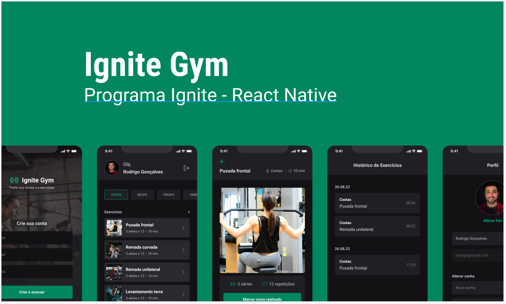

<h1 align="center"> IgNite gym </h1>

Sistema para academia.  

  <a href="#-tecnologias">Tecnologias</a>&nbsp;&nbsp;&nbsp;|&nbsp;&nbsp;&nbsp;
  <a href="#-projeto">Projeto</a>&nbsp;&nbsp;&nbsp;|&nbsp;&nbsp;&nbsp;
  <a href="#-layout">Layout</a>&nbsp;&nbsp;&nbsp;|&nbsp;&nbsp;&nbsp;
  <a href="#memo-licença">Licença</a>

  

 

## 🚀 Tecnologias

Esse projeto foi desenvolvido com as seguintes tecnologias:

- React Native
- Expo
- NativeBase
- Node
- Axios
- Yup
- sqLite
- express
- JavaScript
- Git e Github
- Figma

## 💻 Projeto

O Ignite Gym é um app para academia para registrar as atividades físicas, foi desenvolvido com expo e se conecta a uma api e seus dados são registrados em um banco sqLite
